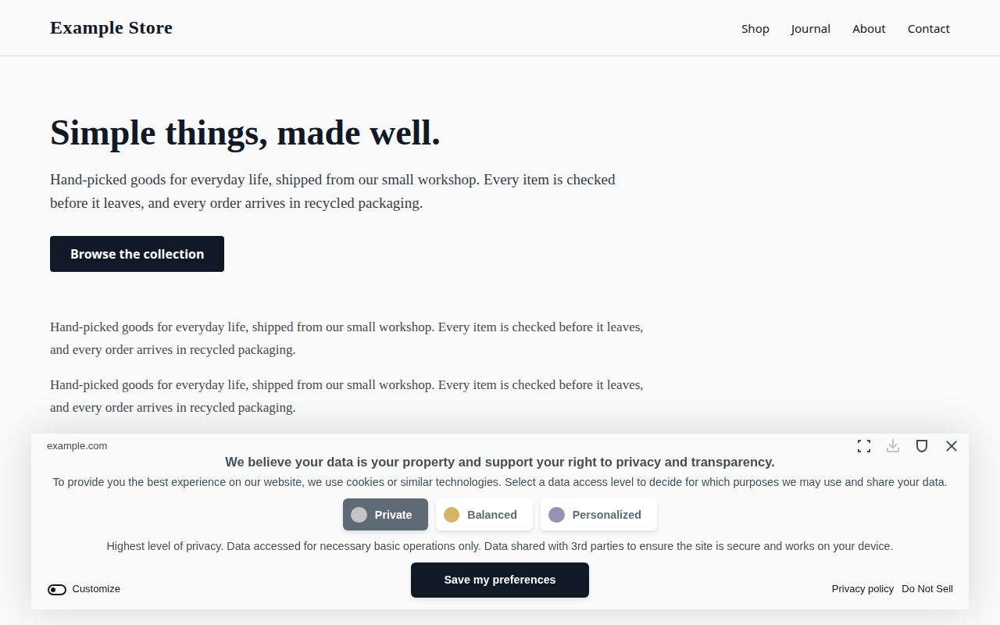
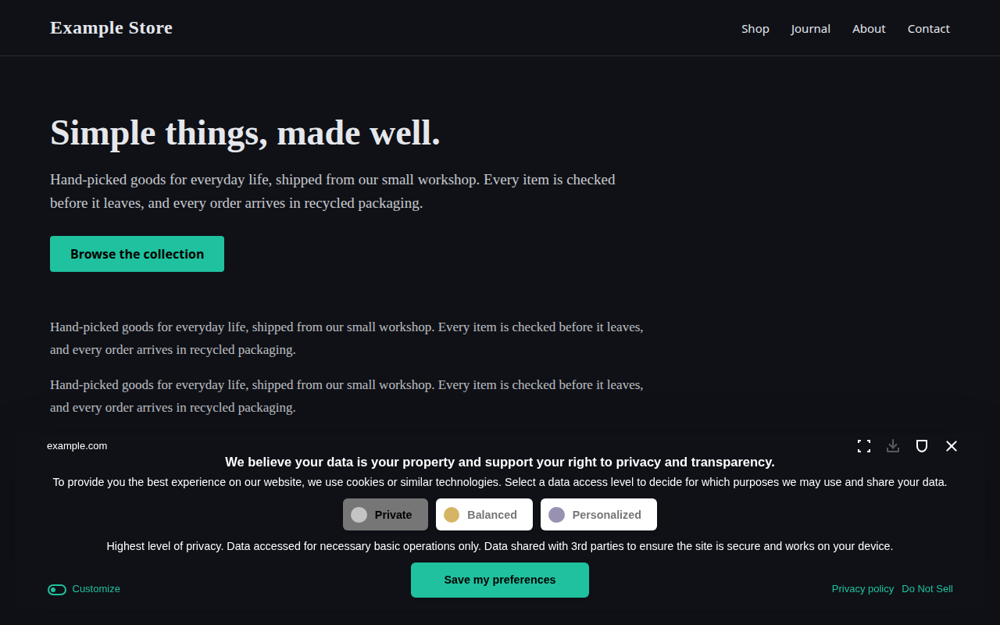
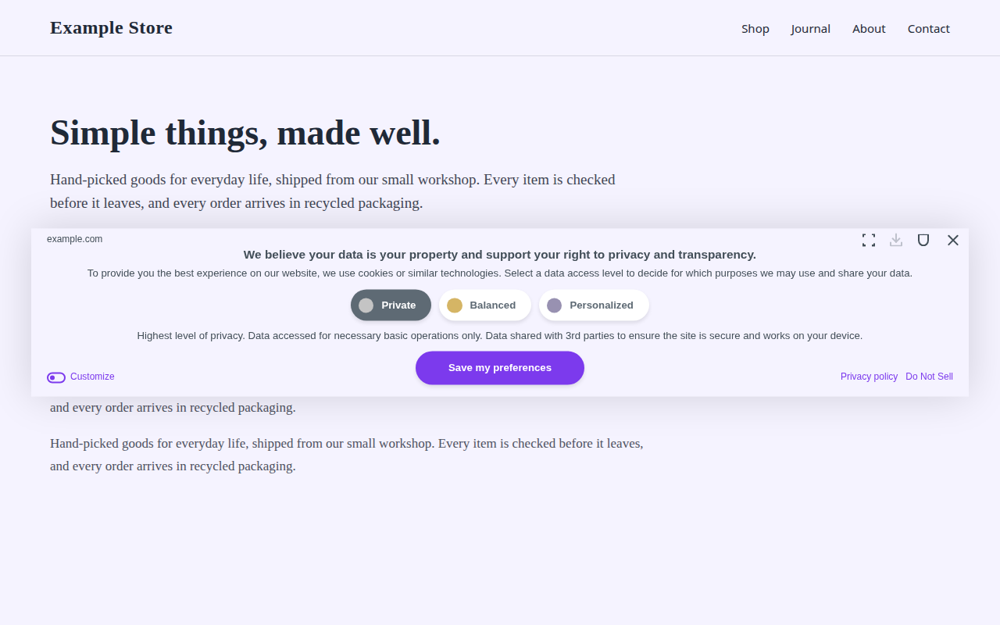
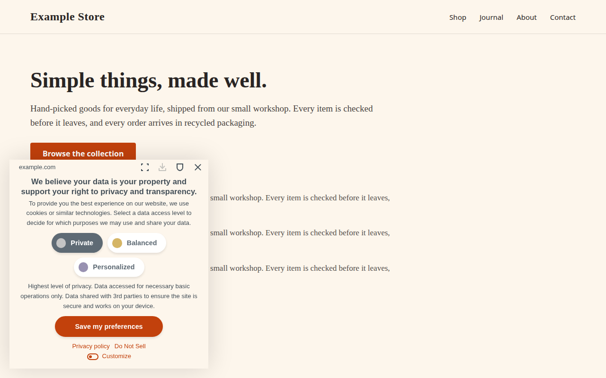
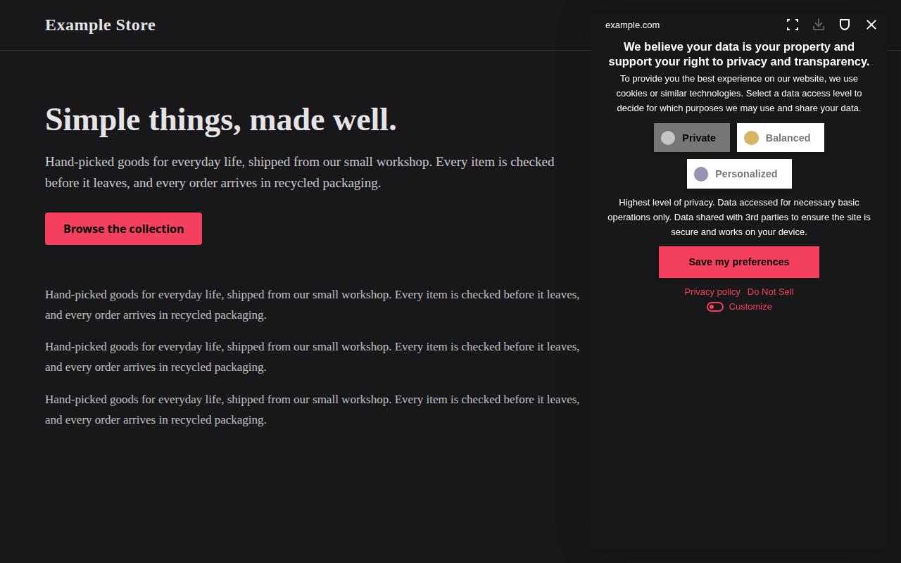
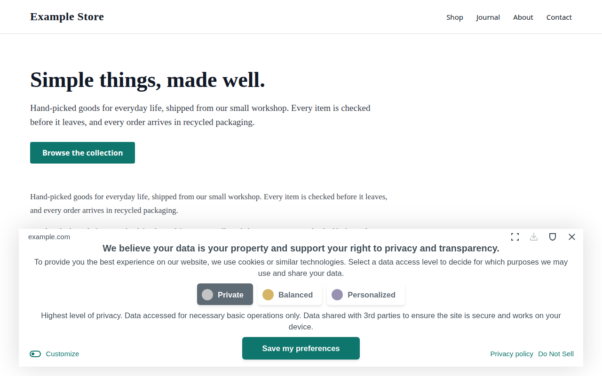
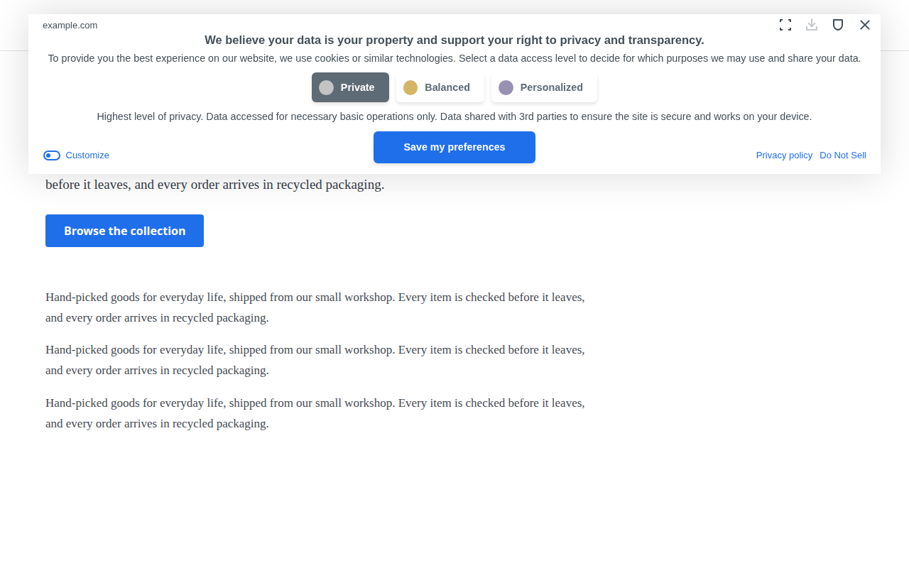

<!-- Generated by scripts/gallery.mjs from gallery/examples.json. Do not edit by hand. -->

# Banner design gallery

Eight example designs for the Cookie Compliance banner. Each one is a screenshot of the real widget in preview mode, using one of its real layouts. The build checks body text and headings against the banner colour, and the button label, the selected and unselected level labels and the links against their backgrounds, at WCAG AA (4.5:1).

## Minimal card



A quiet off-white card with a near-black button, for minimal and monochrome sites.

```json
{
  "position": "bottom",
  "displayType": "floating",
  "bannerOpacity": 1,
  "primaryColor": "#111827",
  "btnTextColor": "#ffffff",
  "bannerColor": "#fafafa",
  "borderColor": "#5e6a74",
  "textColor": "#434f58",
  "headingColor": "#434f58",
  "btnBorderRadius": "6px",
  "textSize": "13px",
  "headingSize": "15px"
}
```

## Dark mint bar



A wide dark bar across the bottom with a mint button, for dark-themed sites.

```json
{
  "position": "bottom",
  "displayType": "fixed",
  "bannerOpacity": 1,
  "primaryColor": "#20c19e",
  "btnTextColor": "#000000",
  "bannerColor": "#0f1117",
  "borderColor": "#767676",
  "textColor": "#ffffff",
  "headingColor": "#ffffff",
  "btnBorderRadius": "6px",
  "textSize": "13px",
  "headingSize": "15px"
}
```

## Corporate top bar


A wide white bar across the top with a navy, square-cornered button.

```json
{
  "position": "top",
  "displayType": "fixed",
  "bannerOpacity": 1,
  "primaryColor": "#1d3a8a",
  "btnTextColor": "#ffffff",
  "bannerColor": "#ffffff",
  "borderColor": "#5e6a74",
  "textColor": "#434f58",
  "headingColor": "#434f58",
  "btnBorderRadius": "0px",
  "textSize": "13px",
  "headingSize": "15px"
}
```

## Centered violet



A wide pale-violet panel centred on the page, with a pill-shaped violet button and slightly smaller text.

```json
{
  "position": "center",
  "displayType": "floating",
  "bannerOpacity": 1,
  "primaryColor": "#7c3aed",
  "btnTextColor": "#ffffff",
  "bannerColor": "#f5f3ff",
  "borderColor": "#5e6a74",
  "textColor": "#434f58",
  "headingColor": "#434f58",
  "btnBorderRadius": "25px",
  "textSize": "12px",
  "headingSize": "14px"
}
```

## Warm left card



A narrow cream card at the bottom left with a burnt-orange pill button, for warm, editorial sites.

```json
{
  "position": "left",
  "displayType": "floating",
  "bannerOpacity": 1,
  "primaryColor": "#c2410c",
  "btnTextColor": "#ffffff",
  "bannerColor": "#fdf6ec",
  "borderColor": "#5e6a74",
  "textColor": "#434f58",
  "headingColor": "#434f58",
  "btnBorderRadius": "25px",
  "textSize": "13px",
  "headingSize": "15px"
}
```

## Dark rose side panel



A full-height dark panel down the right side with a rose, square-cornered button.

```json
{
  "position": "right",
  "displayType": "fixed",
  "bannerOpacity": 1,
  "primaryColor": "#f43f5e",
  "btnTextColor": "#000000",
  "bannerColor": "#18181b",
  "borderColor": "#767676",
  "textColor": "#ffffff",
  "headingColor": "#ffffff",
  "btnBorderRadius": "0px",
  "textSize": "13px",
  "headingSize": "15px"
}
```

## Large text teal



A white bottom card with a teal button and larger text, for readability-first sites.

```json
{
  "position": "bottom",
  "displayType": "floating",
  "bannerOpacity": 1,
  "primaryColor": "#0f766e",
  "btnTextColor": "#ffffff",
  "bannerColor": "#ffffff",
  "borderColor": "#5e6a74",
  "textColor": "#434f58",
  "headingColor": "#434f58",
  "btnBorderRadius": "6px",
  "textSize": "15px",
  "headingSize": "18px"
}
```

## Blue top card



A white card floating at the top with a bright blue button, for clean product sites.

```json
{
  "position": "top",
  "displayType": "floating",
  "bannerOpacity": 1,
  "primaryColor": "#1f6feb",
  "btnTextColor": "#ffffff",
  "bannerColor": "#ffffff",
  "borderColor": "#5e6a74",
  "textColor": "#434f58",
  "headingColor": "#434f58",
  "btnBorderRadius": "6px",
  "textSize": "13px",
  "headingSize": "15px"
}
```

## Apply a design to your live banner

A `design` block set on your own page is overwritten by your app's published configuration a moment after the banner loads. To use one of these designs on a live banner:

- **Dashboard:** set the same values in your app's banner design settings, then publish.
- **MCP server:** call `account.previewDesignChange` with your AppID and the `design` object, show the before/after to the site owner, then call `account.updateDesign` with the same object and the returned `previewToken`.

Never add a `design` block to the install snippet. To derive a design from your own site's colours instead, follow [`skills/match-site-design/SKILL.md`](../skills/match-site-design/SKILL.md).
